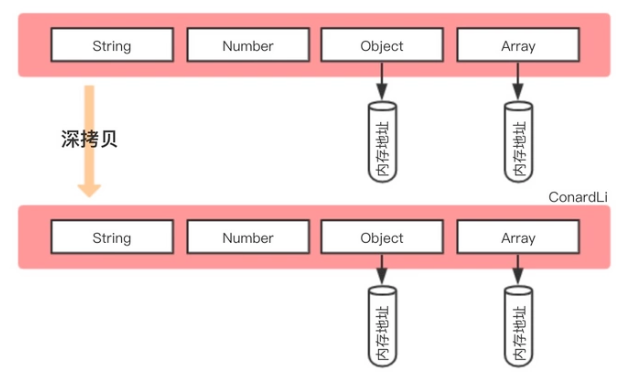

# 浅拷贝与深拷贝

若有陌生或不清楚的可再到 [变量](../../%E7%9B%B4%E5%87%BB%E6%A6%82%E5%BF%B5/02js/s_js_2-%E5%8F%98%E9%87%8F) 回顾

## 什么是浅拷贝

浅拷贝是创建一个新对象，这个对象有着原始对象属性值的一份精确拷贝。如果属性是基本类型，拷贝的就是基本类型的值，如果属性是引用类型，拷贝的就是内存地址 ，所以`如果其中一个对象改变了这个地址，就会影响到另一个对象`。

::: details 实现浅拷贝的几种方式

1. `Object.assign()`
2. `lodash`的 \_.clone 方法
3. ES6 展开运算符 `...`
4. Array.prototype.`concat()`
5. Array.prototype.`slice()`
   :::

## 什么是深拷贝

深拷贝是将一个对象从内存中完整的拷贝一份出来,从堆内存中开辟一个新的区域存放新对象，且`修改新对象不会影响原对象`。

## 赋值和深浅拷贝的区别

::: details 实现深拷贝的几种方式

1. JSON.parse(JSON.stringify()) `缺点是不能处理函数和正则`
2. `lodash`的 `_.cloneDeep` 方法
3. `jQuery.extend()` 方法
4. 手写递归方法 - 见 [deepCopy](../../%E7%BC%96%E5%86%99%E4%BB%A3%E7%A0%81/02js/c_js_2-deepcopy/c_js_2-deepcopy.md)
   :::

## 参考资料

- 浅拷贝与深拷贝 <https://juejin.cn/post/6844904197595332622?searchId=202402042313047067239A1F85E73E9131>

- 深拷贝的终极探索 <https://segmentfault.com/a/1190000016672263>

- How to deep clone a JavaScript object<https://flaviocopes.com/how-to-clone-javascript-object/>
