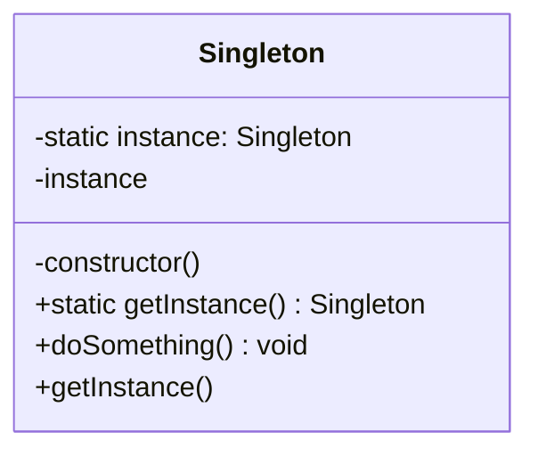

# 单例模式 Singleton Pattern

## 概念

单例模式确保一个类只有一个实例，并提供一个全局访问点。在 JavaScript 中，单例模式常用于管理共享状态（如全局配置、日志记录器、数据库连接池等）。

## 核心思想

限制类的实例化次数为一次，第二次及之后的实例化请求都返回同一个实例。



## 代码实现

### ES6 Class 实现

```ts
class Database {
  private static instance: Database
  private connections: Map<string, any> = new Map()

  private constructor() {
    // 私有构造函数防止外部 new
  }

  static getInstance(): Database {
    if (!Database.instance) {
      Database.instance = new Database()
    }
    return Database.instance
  }

  connect(dbName: string): void {
    if (!this.connections.has(dbName)) {
      this.connections.set(dbName, { id: Date.now(), name: dbName })
    }
  }

  getConnections(): Map<string, any> {
    return this.connections
  }
}

// 使用
const db1 = Database.getInstance()
const db2 = Database.getInstance()
console.log(db1 === db2) // true — 同一个实例
```

### 闭包 + 模块实现（更常用）

```ts
// config.ts
interface AppConfig {
  apiUrl: string
  theme: 'light' | 'dark'
  lang: string
}

function createConfig(): AppConfig & { update: (partial: Partial<AppConfig>) => void } {
  const state: AppConfig = {
    apiUrl: '/api',
    theme: 'light',
    lang: 'zh-CN',
  }

  return {
    get apiUrl() { return state.apiUrl },
    get theme() { return state.theme },
    get lang() { return state.lang },
    update(partial: Partial<AppConfig>) {
      Object.assign(state, partial)
    },
  }
}

export const appConfig = createConfig()
```

## 前端应用场景

| 场景 | 说明 |
|------|------|
| 全局状态管理 | Vuex/Pinia/Redux store 本质上是单例 |
| 日志服务 | 统一日志收集器，避免多个实例分散日志 |
| 事件总线 | EventBus 全局通信（注意内存泄漏） |
| 缓存管理器 | 请求缓存/计算结果缓存，全局唯一 |
| 页面级 Dialog | 确保弹窗组件全局只有一个实例 |

## 优缺点

**优点**
- 严格控制唯一实例，避免多实例带来的状态不一致
- 节省内存，无需重复创建
- 提供全局访问点，方便跨模块通信

**缺点**
- 引入全局状态，增加模块间隐式耦合
- 难以进行单元测试（需 mock 重置状态）
- 违反单一职责原则（同时管理自身创建和业务逻辑）
- 在多线程/Worker 环境下需要额外处理

> 来源：[JavaScript Design Patterns — Singleton](https://www.patterns.dev/vanilla/singleton-pattern)
