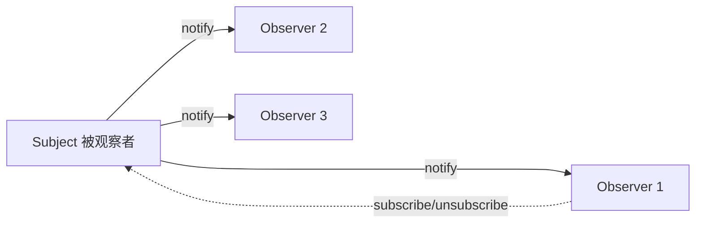

# 观察者模式 Observer Pattern

## 概念

观察者模式定义了一种一对多的依赖关系：当一个对象（Subject）状态发生变化时，所有依赖它的对象（Observers）都会自动收到通知并更新。这是前端最常用的设计模式之一。

## 核心思想

Subject 维护一个 Observer 列表，状态变化时遍历通知；Observer 可随时订阅/取消订阅。



## 代码实现

### 基础实现

```ts
interface Observer<T> {
  update(data: T): void
}

class Subject<T> {
  private observers = new Set<Observer<T>>()

  subscribe(observer: Observer<T>): () => void {
    this.observers.add(observer)
    return () => this.observers.delete(observer) // 返回取消订阅函数
  }

  notify(data: T): void {
    this.observers.forEach(observer => observer.update(data))
  }
}

// 使用示例 — 股票行情
class StockDisplay implements Observer<{ symbol: string; price: number }> {
  constructor(private elementId: string) {}
  update(data: { symbol: string; price: number }): void {
    console.log(`[${this.elementId}] ${data.symbol}: $${data.price}`)
  }
}

const stockSubject = new Subject<{ symbol: string; price: number }>()
const display1 = new StockDisplay('panel-a')
const display2 = new StockDisplay('panel-b')

const unsub1 = stockSubject.subscribe(display1)
stockSubject.subscribe(display2)

stockSubject.notify({ symbol: 'AAPL', price: 185.5 }) // 两个 display 都更新
unsub1() // display1 取消订阅
stockSubject.notify({ symbol: 'AAPL', price: 186.0 }) // 仅 display2 更新
```

### 进阶 —— 事件类型区分

```ts
type EventMap = {
  userLogin: { userId: string; timestamp: number }
  userLogout: { userId: string }
  dataChange: { key: string; value: unknown }
}

class EventObserver<T extends Record<string, any>> {
  private listeners = new Map<string, Set<(data: any) => void>>()

  on<K extends keyof T>(event: K, fn: (data: T[K]) => void): () => void {
    if (!this.listeners.has(event as string)) {
      this.listeners.set(event as string, new Set())
    }
    this.listeners.get(event as string)!.add(fn)
    return () => this.listeners.get(event as string)?.delete(fn)
  }

  emit<K extends keyof T>(event: K, data: T[K]): void {
    this.listeners.get(event as string)?.forEach(fn => fn(data))
  }
}

// 使用
const bus = new EventObserver<EventMap>()
bus.on('userLogin', ({ userId }) => console.log(`User ${userId} logged in`))
bus.emit('userLogin', { userId: 'u123', timestamp: Date.now() })
```

## 前端应用场景

| 场景 | 说明 |
|------|------|
| DOM 事件 | `addEventListener` 就是观察者模式 |
| Vue 响应式 | 数据变化 → 自动更新视图 |
| MutationObserver | DOM 变化监听 |
| IntersectionObserver | 元素可见性监听 |
| 自定义事件总线 | 跨组件通信（非父子） |

## 优缺点

**优点**
- Subject 和 Observer 松耦合，各自独立变化
- 支持广播通信，一对多通知很方便
- 运行时动态添加/移除观察者

**缺点**
- 通知顺序不可控，可能导致意料之外的副作用
- 大量观察者时遍历通知有性能开销
- 未及时取消订阅会导致内存泄漏

> 来源：[Refactoring Guru — Observer](https://refactoring.guru/design-patterns/observer)
