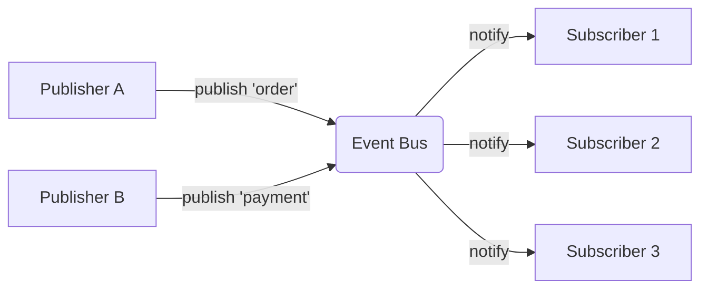

# 发布-订阅模式 PubSub Pattern

## 概念

发布-订阅模式是观察者模式的变体，引入了**事件通道（Event Channel/Broker）**作为中介，将发布者和订阅者完全解耦。发布者只管发消息到频道，不管谁在听；订阅者只管从频道收消息，不管谁发的。

## 核心思想

通过命名的事件通道来路由消息，发布者（Publisher）和订阅者（Subscriber）互不知晓对方的存在。



## 观察者 vs 发布-订阅

| 维度 | 观察者 Observer | 发布-订阅 PubSub |
|------|:---:|:---:|
| 耦合度 | Subject 知道 Observer 列表 | 双方互不知晓 |
| 通信中介 | 无（直接通知） | 事件通道/总线 |
| 粒度 | 通常面向特定 Subject | 按事件名称/主题路由 |
| 适用场景 | 组件内/模块内 | 跨模块/跨组件 |

## 代码实现

```ts
class PubSub {
  private channels = new Map<string, Set<(...args: any[]) => void>>()

  // 订阅
  on(channel: string, handler: (...args: any[]) => void): () => void {
    if (!this.channels.has(channel)) {
      this.channels.set(channel, new Set())
    }
    this.channels.get(channel)!.add(handler)
    return () => this.off(channel, handler)
  }

  // 取消订阅
  off(channel: string, handler: (...args: any[]) => void): void {
    this.channels.get(channel)?.delete(handler)
  }

  // 发布 — 所有订阅者收到
  emit(channel: string, ...args: any[]): void {
    this.channels.get(channel)?.forEach(handler => {
      try { handler(...args) } catch (e) { console.error('[PubSub]', channel, e) }
    })
  }

  // 一次性订阅
  once(channel: string, handler: (...args: any[]) => void): void {
    const wrapper = (...args: any[]) => {
      this.off(channel, wrapper)
      handler(...args)
    }
    this.on(channel, wrapper)
  }

  // 清理
  clear(channel?: string): void {
    channel ? this.channels.delete(channel) : this.channels.clear()
  }
}

// 全局单例
export const pubsub = new PubSub()
```

### 使用示例

```ts
// 订单模块 — 发布者
async function createOrder(items: string[]) {
  await saveToDB(items)
  pubsub.emit('order:created', { orderId: 'ord-123', items })
  // 不需要知道谁在监听
}

// 通知模块 — 订阅者
pubsub.on('order:created', ({ orderId }) => {
  sendNotification(orderId)
})

// 日志模块 — 另一个订阅者（完全独立）
pubsub.on('order:created', (data) => {
  analytics.track('order_created', data)
})

// 取消订阅
const unsub = pubsub.on('order:created', handler)
// 组件卸载时
unsub()
```

## 前端应用场景

| 场景 | 说明 |
|------|------|
| 跨组件通信 | 非父子组件间的数据传递 |
| 微前端通信 | 子应用间通过全局事件总线通信 |
| 插件系统 | 主程序发事件，插件监听并响应 |
| 埋点/日志 | 各种业务事件统一收集 |
| WebSocket 消息分发 | 服务端推送消息按 channel 路由 |

## 优缺点

**优点**
- 发布者和订阅者完全解耦，各自独立开发和测试
- 支持一对多广播，新增订阅者无需修改发布者
- 命名事件提供了清晰的通信契约

**缺点**
- 事件名是字符串，容易拼写错误或重复
- 事件流向不直观，调试困难（"谁发的？谁在听？"）
- 订阅者未及时取消会导致内存泄漏

> 来源：[JavaScript Design Patterns — PubSub](https://www.patterns.dev/vanilla/observer-pattern)
