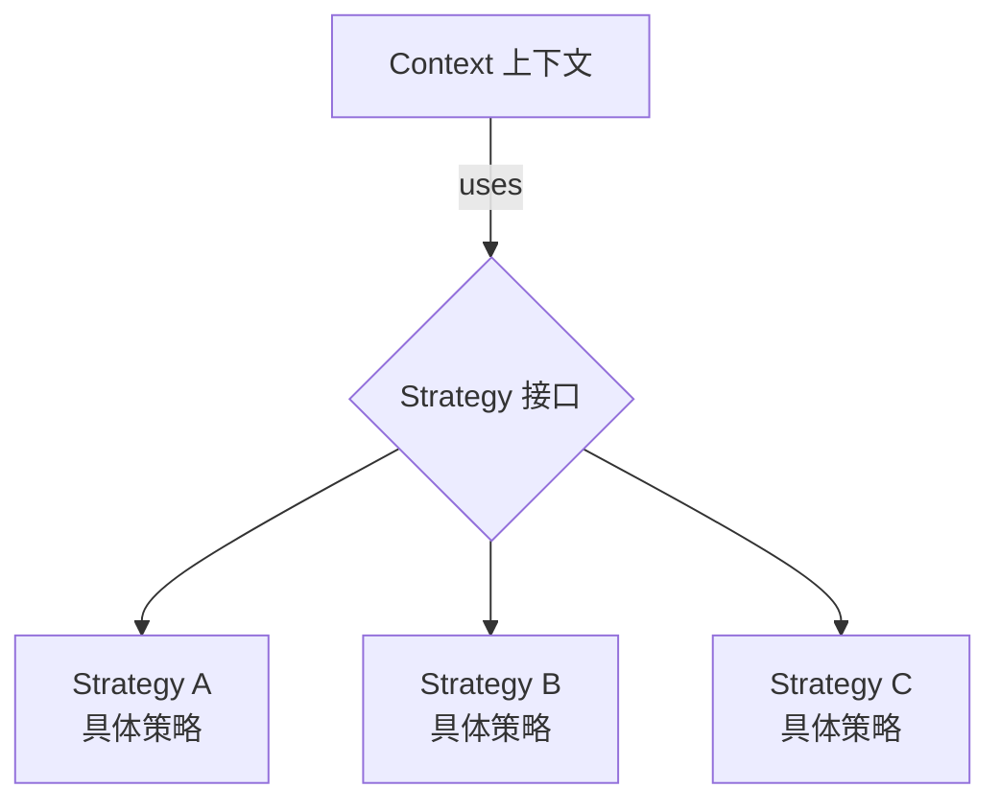

# 策略模式 Strategy Pattern

## 概念

策略模式定义一系列算法，将每个算法封装起来并让它们可以互相替换。策略模式让算法的变化独立于使用它的客户端。简单理解：**把 if-else 或 switch-case 替换为策略对象**。

## 核心思想

将不同行为封装为独立策略对象，运行时选择合适策略执行。



## 代码实现

### 格式校验策略

```ts
// 策略接口
interface ValidationStrategy {
  validate(value: unknown): { valid: boolean; message?: string }
}

// 具体策略
const requiredRule: ValidationStrategy = {
  validate(value) {
    if (value === undefined || value === null || value === '') {
      return { valid: false, message: '此项为必填' }
    }
    return { valid: true }
  },
}

const emailRule: ValidationStrategy = {
  validate(value) {
    if (typeof value !== 'string' || !/^[^\s@]+@[^\s@]+\.[^\s@]+$/.test(value)) {
      return { valid: false, message: '请输入有效的邮箱地址' }
    }
    return { valid: true }
  },
}

const minLengthRule = (min: number): ValidationStrategy => ({
  validate(value) {
    if (typeof value === 'string' && value.length < min) {
      return { valid: false, message: `最少需要 ${min} 个字符` }
    }
    return { valid: true }
  },
})

// Context — 使用策略
class FormField {
  private rules: ValidationStrategy[] = []

  constructor(public name: string) {}

  addRule(rule: ValidationStrategy): this {
    this.rules.push(rule)
    return this
  }

  validate(value: unknown): string[] {
    return this.rules
      .map(rule => rule.validate(value))
      .filter(r => !r.valid)
      .map(r => r.message!)
  }
}

// 使用 — 声明式配置校验规则
const usernameField = new FormField('username')
  .addRule(requiredRule)
  .addRule(minLengthRule(3))

console.log(usernameField.validate('ab')) // ['最少需要 3 个字符']
```

### 折扣计算策略

```ts
interface DiscountStrategy {
  calculate(price: number): number
  name: string
}

const strategies: Record<string, DiscountStrategy> = {
  normal: { name: '原价', calculate: p => p },
  member: { name: '会员9折', calculate: p => p * 0.9 },
  vip: { name: 'VIP8折', calculate: p => p * 0.8 },
  clearance: { name: '清仓5折', calculate: p => p * 0.5 },
}

function calcPrice(price: number, type: string): { final: number; desc: string } {
  const strategy = strategies[type] ?? strategies.normal
  return {
    final: strategy.calculate(price),
    desc: `${strategy.name}: ¥${strategy.calculate(price)}`,
  }
}
```

## 前端应用场景

| 场景 | 说明 |
|------|------|
| 表单校验 | 每种校验规则是一个策略 |
| 排序/筛选 | 不同排序算法或筛选条件 |
| 支付方式 | 微信/支付宝/银行卡各有计算逻辑 |
| 主题切换 | 不同主题应用不同样式策略 |
| 日志级别 | Debug/Warn/Error 不同处理策略 |

## 优缺点

**优点**
- 消除大量 if-else/switch-case，代码更清晰
- 策略可独立测试，符合开闭原则（新增策略无需改 Context）
- 运行时动态切换策略

**缺点**
- 策略类过多时管理成本增加
- 客户端需要知道有哪些策略可用
- 策略间如有共享状态，需要额外处理

> 来源：[Refactoring Guru — Strategy](https://refactoring.guru/design-patterns/strategy)
