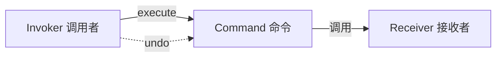

# 命令模式 Command Pattern

## 概念

命令模式将请求封装为对象，从而允许使用不同的请求参数化客户端、支持请求的排队/记录日志，以及实现可撤销的操作。它将"调用者"与"执行者"解耦。

## 核心思想

把操作封装为 Command 对象，包含执行该操作所需的所有信息（接收者 + 方法 + 参数）。



## 代码实现

### 可撤销的编辑器

```ts
// Receiver — 编辑器文档
class Document {
  private content: string = ''

  insert(pos: number, text: string): void {
    this.content = this.content.slice(0, pos) + text + this.content.slice(pos)
  }

  delete(pos: number, length: number): string {
    const deleted = this.content.slice(pos, pos + length)
    this.content = this.content.slice(0, pos) + this.content.slice(pos + length)
    return deleted
  }

  getContent(): string { return this.content }
}

// Command 接口
interface Command {
  execute(): void
  undo(): void
}

// 具体命令 — 插入
class InsertCommand implements Command {
  constructor(
    private doc: Document,
    private pos: number,
    private text: string
  ) {}

  execute(): void { this.doc.insert(this.pos, this.text) }
  undo(): void { this.doc.delete(this.pos, this.text.length) }
}

// 具体命令 — 删除
class DeleteCommand implements Command {
  private deleted: string = ''

  constructor(
    private doc: Document,
    private pos: number,
    private length: number
  ) {}

  execute(): void {
    this.deleted = this.doc.delete(this.pos, this.length)
  }

  undo(): void {
    this.doc.insert(this.pos, this.deleted)
  }
}

// Invoker — 命令历史
class CommandHistory {
  private undoStack: Command[] = []
  private redoStack: Command[] = []

  execute(cmd: Command): void {
    cmd.execute()
    this.undoStack.push(cmd)
    this.redoStack = [] // 新操作清空 redo
  }

  undo(): void {
    const cmd = this.undoStack.pop()
    if (cmd) {
      cmd.undo()
      this.redoStack.push(cmd)
    }
  }

  redo(): void {
    const cmd = this.redoStack.pop()
    if (cmd) {
      cmd.execute()
      this.undoStack.push(cmd)
    }
  }
}

// 使用
const doc = new Document()
const history = new CommandHistory()

history.execute(new InsertCommand(doc, 0, 'Hello'))
history.execute(new InsertCommand(doc, 5, ' World'))
console.log(doc.getContent()) // "Hello World"
history.undo()
console.log(doc.getContent()) // "Hello"
history.redo()
console.log(doc.getContent()) // "Hello World"
```

### 宏命令 —— 批处理

```ts
class MacroCommand implements Command {
  constructor(private commands: Command[]) {}

  execute(): void { this.commands.forEach(c => c.execute()) }
  undo(): void { [...this.commands].reverse().forEach(c => c.undo()) }
}
```

## 前端应用场景

| 场景 | 说明 |
|------|------|
| 撤销/重做 | 编辑器、画板、表单回退 |
| 操作队列 | 离线操作排队同步 |
| 宏录制 | 批量操作录制和回放 |
| 菜单/工具栏 | 每个按钮绑定一个命令对象 |
| 请求节流 | 命令入队，按策略调度执行 |

## 优缺点

**优点**
- 调用者与执行者解耦，可灵活替换
- 支持撤销/重做、排队、日志
- 可将命令序列化/持久化

**缺点**
- 每个操作都需要一个类，命令类可能爆炸增长
- 简单的操作用命令模式过于"重"
- 命令与接收者生命周期管理需注意

> 来源：[JavaScript Design Patterns — Command](https://www.patterns.dev/vanilla/command-pattern)
