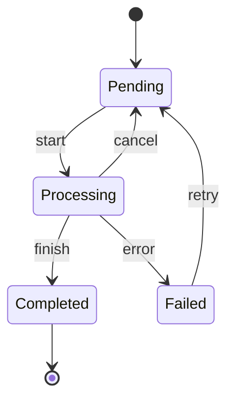

# 状态模式 State Pattern

## 概念

状态模式允许对象在其内部状态改变时改变其行为，看起来就像对象改变了它的类。它将每个状态封装为独立的类，状态间的转换由 Context 或 State 自身管理。

## 核心思想

将状态相关行为封装到独立的状态对象中，委托当前状态对象处理请求，避免巨型 switch-case。



## 代码实现

### 订单状态机

```ts
// State 接口
interface OrderState {
  name: string
  canCancel: boolean
  process(order: Order): void
  complete(order: Order): void
  fail(order: Order, reason: string): void
}

// Context
class Order {
  private state: OrderState = new PendingState()

  getState(): OrderState { return this.state }

  transition(next: OrderState): void {
    console.log(`[Order] ${this.state.name} → ${next.name}`)
    this.state = next
  }

  process() { this.state.process(this) }
  complete() { this.state.complete(this) }
  fail(reason: string) { this.state.fail(this, reason) }
}

// 具体状态
class PendingState implements OrderState {
  name = '待处理'
  canCancel = true

  process(order: Order): void {
    order.transition(new ProcessingState())
  }
  complete(order: Order): void {
    throw new Error('待处理状态不能直接完成')
  }
  fail(order: Order, reason: string): void {
    order.transition(new FailedState(reason))
  }
}

class ProcessingState implements OrderState {
  name = '处理中'
  canCancel = true

  process(): void { throw new Error('已经在处理中') }
  complete(order: Order): void {
    order.transition(new CompletedState())
  }
  fail(order: Order, reason: string): void {
    order.transition(new FailedState(reason))
  }
}

class CompletedState implements OrderState {
  name = '已完成'
  canCancel = false

  process(): void { throw new Error('已完成订单不可处理') }
  complete(): void { throw new Error('已完成订单不可重复完成') }
  fail(): void { throw new Error('已完成订单不可失败') }
}

class FailedState implements OrderState {
  name = '已失败'
  canCancel = false

  constructor(public reason: string) {}

  process(order: Order): void {
    order.transition(new ProcessingState()) // 重试
  }
  complete(): void { throw new Error('已失败订单不可完成') }
  fail(): void { throw new Error('已失败订单不可重复失败') }
}

// 使用
const order = new Order()
order.process()  // 待处理 → 处理中
order.complete()  // 处理中 → 已完成
```

### 简化版 —— 函数式状态

```ts
// 对于简单场景，可用函数替代类
type StateFn = {
  name: string
  transitions: Record<string, () => StateFn>
}

function createStateMachine(
  initial: StateFn,
  onTransition: (from: string, to: string) => void
) {
  let current = initial

  return {
    get state() { return current.name },
    send(action: string) {
      const next = current.transitions[action]
      if (next) {
        const from = current.name
        current = next()
        onTransition(from, current.name)
      }
    },
  }
}
```

## 前端应用场景

| 场景 | 说明 |
|------|------|
| 订单/工单系统 | 状态流转和权限控制 |
| 多步骤表单 | 每步有不同验证和 UI |
| 播放器状态 | 播放/暂停/缓冲/停止 |
| 登录状态 | 未登录/登录中/已登录/登录过期 |
| Promise 三态 | pending → fulfilled/rejected |

## 优缺点

**优点**
- 消除庞大的 if-else/switch-case
- 状态转换规则集中可见，易于维护
- 新增状态只需添加新类，符合开闭原则

**缺点**
- 状态类数量多时会增加维护成本
- 状态间的转换逻辑可能分散在不同类中
- 简单状态机用 switch 就够了，过度设计

> 来源：[Refactoring Guru — State](https://refactoring.guru/design-patterns/state)
