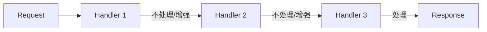

# 责任链模式 Chain of Responsibility Pattern

## 概念

责任链模式将请求沿着处理器链传递，直到某个处理器处理它为止。每个处理器决定是自己处理还是传递给下一个。前端中最典型的应用就是**中间件（Middleware）**模式。

## 核心思想

将多个处理对象连成一条链，请求沿链传递，每个处理者决定：处理、传递、或者终止。



## 代码实现

### Express/Koa 风格中间件

```ts
type Next = () => void
type Middleware<T> = (ctx: T, next: Next) => void

class MiddlewareChain<T> {
  private middlewares: Middleware<T>[] = []

  use(...mws: Middleware<T>[]): this {
    this.middlewares.push(...mws)
    return this
  }

  run(ctx: T): void {
    let index = -1

    const dispatch = (i: number): void => {
      if (i <= index) throw new Error('next() called multiple times')
      index = i
      const middleware = this.middlewares[i]
      if (middleware) {
        middleware(ctx, () => dispatch(i + 1))
      }
    }

    dispatch(0)
  }
}

// 使用
interface RequestCtx {
  url: string
  user?: { role: string }
  data?: unknown
}

const chain = new MiddlewareChain<RequestCtx>()

// Handler 1: 日志
chain.use((ctx, next) => {
  console.log(`[LOG] ${ctx.url}`)
  next()
})

// Handler 2: 鉴权（可能终止）
chain.use((ctx, next) => {
  if (ctx.url.startsWith('/admin') && ctx.user?.role !== 'admin') {
    return // 不调用 next()，终止链
  }
  next()
})

// Handler 3: 业务处理
chain.use((ctx, next) => {
  ctx.data = { message: `Handled ${ctx.url}` }
  next()
})

chain.run({ url: '/admin/dashboard', user: { role: 'admin' } }) // 三条都执行
chain.run({ url: '/admin/dashboard', user: { role: 'guest' } })  // 鉴权拦截
```

### 表单校验链

```ts
interface ValidationChain {
  setNext(validator: ValidationChain): ValidationChain
  validate(value: unknown): string | null
  protected next(value: unknown): string | null
}

abstract class BaseValidator implements ValidationChain {
  private nextValidator: ValidationChain | null = null

  setNext(validator: ValidationChain): ValidationChain {
    this.nextValidator = validator
    return validator
  }

  abstract validate(value: unknown): string | null

  protected next(value: unknown): string | null {
    return this.nextValidator?.validate(value) ?? null
  }
}

class RequiredValidator extends BaseValidator {
  validate(value: unknown): string | null {
    if (value === undefined || value === null || value === '') {
      return '此项为必填'
    }
    return this.next(value)
  }
}

class EmailValidator extends BaseValidator {
  validate(value: unknown): string | null {
    if (typeof value !== 'string' || !/^.+@.+$/.test(value)) {
      return '邮箱格式不正确'
    }
    return this.next(value)
  }
}

class MaxLengthValidator extends BaseValidator {
  constructor(private max: number) { super() }
  validate(value: unknown): string | null {
    if (typeof value === 'string' && value.length > this.max) {
      return `最多 ${this.max} 个字符`
    }
    return this.next(value)
  }
}

// 组链
const required = new RequiredValidator()
required
  .setNext(new EmailValidator())
  .setNext(new MaxLengthValidator(100))

console.log(required.validate('')) // "此项为必填"
console.log(required.validate('not-email')) // "邮箱格式不正确"
```

## 前端应用场景

| 场景 | 说明 |
|------|------|
| Express/Koa 中间件 | HTTP 请求处理管线 |
| Webpack Loader | 文件处理链（sass-loader → css-loader → style-loader） |
| Vue Router 守卫 | beforeEach 链式拦截 |
| Axios 拦截器 | request/response 拦截器链 |
| 表单校验链 | 逐条验证直到失败 |
| 事件冒泡 | DOM 事件沿树向上传递 |

## 优缺点

**优点**
- 请求发送者与处理者解耦
- 可动态编排处理器链，灵活组合
- 每个 Handler 职责单一，易于测试

**缺点**
- 链过长时影响性能
- 链中断（某 Handler 未调 next）难以排查
- 不能保证请求一定被处理（可能走完整条链无人处理）

> 来源：[Refactoring Guru — Chain of Responsibility](https://refactoring.guru/design-patterns/chain-of-responsibility)
