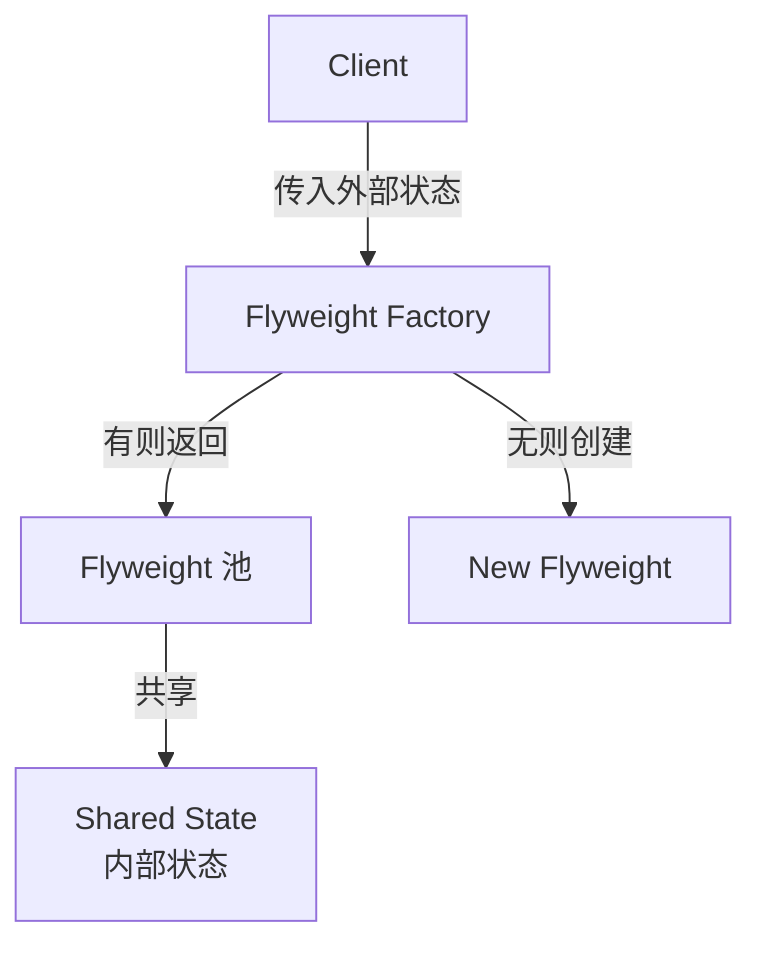

# 享元模式 Flyweight Pattern

## 概念

享元模式通过共享来减少大量细粒度对象的内存占用。它将对象的内部状态（可共享）和外部状态（不可共享）分离，让多个对象共享相同的内部状态。

## 核心思想

当系统需要创建大量相似对象时，提取共享部分只创建一份，减少内存占用。



## 代码实现

### 图书库存系统

```ts
// 内部状态 — 可共享
class Book {
  constructor(
    public title: string,
    public author: string,
    public isbn: string
  ) {}
}

// Flyweight Factory
class BookFactory {
  private books = new Map<string, Book>()

  getBook(title: string, author: string, isbn: string): Book {
    if (!this.books.has(isbn)) {
      this.books.set(isbn, new Book(title, author, isbn))
    }
    return this.books.get(isbn)!
  }

  get count(): number { return this.books.size }
}

// 外部状态 — 每本书独立
interface BookCopy {
  id: string
  shelf: string
  borrowed: boolean
}

// 库存管理
class Library {
  private factory = new BookFactory()
  private copies: BookCopy[] = []

  addCopy(title: string, author: string, isbn: string, shelf: string): void {
    this.factory.getBook(title, author, isbn) // 共享实例
    this.copies.push({ id: `${isbn}_${this.copies.length}`, shelf, borrowed: false })
  }

  stats(): { uniqueBooks: number; totalCopies: number } {
    return { uniqueBooks: this.factory.count, totalCopies: this.copies.length }
  }
}

// 使用 — 10000 本书，但只有 1000 种
const lib = new Library()
for (let i = 0; i < 10000; i++) {
  lib.addCopy(`Book ${i % 1000}`, `Author ${i % 1000}`, `ISBN-${i % 1000}`, `Shelf-${i % 100}`)
}
console.log(lib.stats()) // { uniqueBooks: 1000, totalCopies: 10000 } 节省了 9000 个 Book 对象
```

### DOM 对象池

```ts
class ObjectPool<T> {
  private pool: T[] = []

  constructor(private factory: () => T, private initialSize = 10) {
    for (let i = 0; i < initialSize; i++) {
      this.pool.push(this.factory())
    }
  }

  acquire(): T {
    return this.pool.pop() ?? this.factory()
  }

  release(obj: T): void {
    this.pool.push(obj)
  }

  get size(): number { return this.pool.length }
}

// 用于复用 DOM 节点
const nodePool = new ObjectPool(() => document.createElement('div'))
```

## 前端应用场景

| 场景 | 说明 |
|------|------|
| 对象池 | 复用 DOM 节点、Web Worker、Canvas 对象 |
| 虚拟列表 | 复用可视区域的 DOM 元素 |
| 字符共享 | 字符串常量池（V8 的字符串内部化） |
| 地图标记 | 共享标记图标模板 |

## 优缺点

**优点**
- 大幅减少内存中对象数量
- 适合大量相似对象的场景

**缺点**
- 增加了共享逻辑的复杂度
- 内部/外部状态分离增加代码理解难度
- 现代硬件内存充裕时收益有限

> 来源：[JavaScript Design Patterns — Flyweight](https://www.patterns.dev/vanilla/flyweight-pattern)
