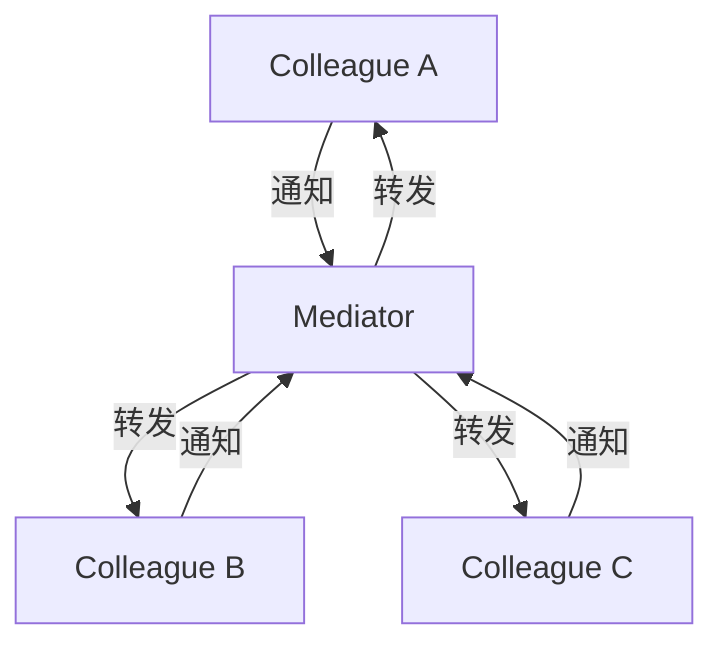

# 中介者模式 Mediator Pattern

## 概念

中介者模式通过引入一个中介对象来封装一组对象之间的交互，将多对多的网状关系简化为一对多的星形关系。前端中最常见的例子是 Express 中间件、Vuex Store、Redux。

## 核心思想

禁止对象间直接通信，所有通信必须经过中介者。每个对象只依赖中介者，而不是依赖其他所有对象。



## 代码实现

### 聊天室

```ts
interface ChatMediator {
  sendMessage(user: User, message: string): void
  addUser(user: User): void
}

class ChatRoom implements ChatMediator {
  private users: User[] = []

  addUser(user: User): void {
    this.users.push(user)
    user.setMediator(this)
  }

  sendMessage(sender: User, message: string): void {
    const timestamp = new Date().toLocaleTimeString()
    this.users.forEach(user => {
      if (user !== sender) {
        user.receive(`[${timestamp}] ${sender.name}: ${message}`)
      }
    })
  }
}

class User {
  constructor(public name: string) {}
  private mediator: ChatMediator

  setMediator(mediator: ChatMediator): void { this.mediator = mediator }

  send(message: string): void {
    console.log(`${this.name} sends: ${message}`)
    this.mediator.sendMessage(this, message)
  }

  receive(message: string): void {
    console.log(`${this.name} receives: ${message}`)
  }
}

// 使用
const room = new ChatRoom()
const alice = new User('Alice')
const bob = new User('Bob')
const carol = new User('Carol')

room.addUser(alice)
room.addUser(bob)
room.addUser(carol)

alice.send('Hello everyone!') // Bob 和 Carol 都收到
```

### 组件协调器（Micro Frontend 场景）

```ts
class ComponentMediator {
  private components = new Map<string, Component>()

  register(name: string, component: Component): void {
    this.components.set(name, component)
  }

  notify(sender: string, event: string, payload: unknown): void {
    this.components.forEach((comp, name) => {
      if (name !== sender) {
        comp.receive(sender, event, payload)
      }
    })
  }
}

interface Component {
  send(event: string, payload: unknown): void
  receive(sender: string, event: string, payload: unknown): void
}

// 具体组件
class SearchBar implements Component {
  mediator: ComponentMediator
  send(event: string, payload: unknown): void {
    this.mediator.notify('SearchBar', event, payload)
  }
  receive(sender: string, event: string, payload: unknown): void {
    // 不需要响应其他组件的事件
  }
}

class ProductList implements Component {
  mediator: ComponentMediator
  send(event: string, payload: unknown): void {
    this.mediator.notify('ProductList', event, payload)
  }
  receive(sender: string, event: string, payload: unknown): void {
    if (sender === 'SearchBar' && event === 'search') {
      console.log('Updating product list with:', payload)
    }
  }
}
```

## 前端应用场景

| 场景 | 说明 |
|------|------|
| Express 中间件 | 请求经过中间件链路由 |
| Redux Store | Components 通过 Store 交互，不直接通信 |
| Vuex/Pinia | 组件间通过 Store 协调 |
| 聊天室 | 用户通过服务器（中介）通信 |
| 表单联动 | 多个表单字段通过中介者协调 |

## 优缺点

**优点**
- 将多对多关系简化为一对多，极大降低耦合
- 集中控制交互逻辑，便于维护和修改
- 新增 Colleague 只需在中介者注册，不涉及其他组件

**缺点**
- 中介者可能演变为"上帝对象"，逻辑高度集中
- 中介者成为单点故障
- 组件与中介者的通信有间接开销

> 来源：[JavaScript Design Patterns — Mediator](https://www.patterns.dev/vanilla/mediator-pattern)
