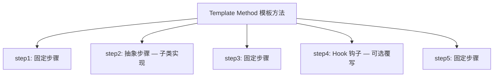

# 模板方法模式 Template Method Pattern

## 概念

模板方法模式在一个方法中定义算法的骨架，将某些步骤延迟到子类中实现。它让子类可以重新定义算法的某些步骤，而不改变算法的整体结构。

## 核心思想

在基类中定义"不变的部分"（骨架），在子类中实现"可变的部分"（具体步骤）。



## 代码实现

### 数据导入处理框架

```ts
abstract class DataImporter {
  // 模板方法 — 定义算法骨架
  async import(file: File): Promise<{ success: number; failed: number }> {
    this.beforeImport(file)
    const rawData = await this.readFile(file)
    const validated = this.onValidate(rawData)
    const transformed = this.transform(validated)
    const result = await this.save(transformed)
    this.afterImport(result)
    return result
  }

  // 固定步骤
  private beforeImport(file: File): void {
    console.log(`[Import] Start: ${file.name} (${file.size} bytes)`)
  }

  private onValidate(data: unknown[]): unknown[] {
    const cleaned = data.filter(item => this.validate(item))
    console.log(`[Import] Validated: ${data.length} → ${cleaned.length}`)
    return cleaned
  }

  private afterImport(result: { success: number; failed: number }): void {
    console.log(`[Import] Done: ${result.success} success, ${result.failed} failed`)
  }

  // 抽象步骤 — 子类必须实现
  protected abstract readFile(file: File): Promise<unknown[]>
  protected abstract validate(item: unknown): boolean
  protected abstract transform(data: unknown[]): unknown[]
  protected abstract save(data: unknown[]): Promise<{ success: number; failed: number }>

  // 钩子方法 — 子类可选覆写
  protected getBatchSize(): number { return 100 }
}

// CSV 导入子类
class CsvImporter extends DataImporter {
  protected async readFile(file: File): Promise<unknown[]> {
    const text = await file.text()
    return text.split('\n').filter(Boolean).map(line => {
      const [name, email] = line.split(',')
      return { name: name?.trim(), email: email?.trim() }
    })
  }

  protected validate(item: unknown): boolean {
    const { email } = item as { email?: string }
    return !!email && email.includes('@')
  }

  protected transform(data: unknown[]): unknown[] {
    return data.map(item => ({
      ...item as object,
      importedAt: new Date().toISOString(),
    }))
  }

  protected async save(data: unknown[]): Promise<{ success: number; failed: number }> {
    // API 调用
    return { success: data.length, failed: 0 }
  }

  protected getBatchSize(): number { return 200 } // 覆写钩子
}
```

### 前端应用：组件生命周期

```ts
// Vue 组件生命周期的模板方法模式
abstract class BaseComponent {
  // 模板方法 — 生命周期骨架（框架调用）
  setup() {
    this.beforeCreate()
    this.created()
    this.beforeMount()
    this.render()
    this.mounted()
  }

  // 抽象步骤 — 开发者实现
  protected abstract render(): void

  // 钩子 — 可选覆写
  protected beforeCreate() {}
  protected created() {}
  protected beforeMount() {}
  protected mounted() {}
}
```

## 前端应用场景

| 场景 | 说明 |
|------|------|
| 框架生命周期 | Vue/React 生命周期钩子 |
| 数据导入/导出 | CSV/Excel/JSON 不同格式，统一流程 |
| 表单提交 | 校验 → 转换 → 提交 → 反馈 |
| API 请求 | 准备 → 发送 → 解析 → 缓存 → 错误处理 |
| CI/CD Pipeline | 编译 → 测试 → 打包 → 部署 |

## 优缺点

**优点**
- 复用不变代码，减少重复
- 子类只需关注可变部分，职责清晰
- 通过钩子提供扩展点，符合开闭原则

**缺点**
- 骨架固定后不便修改整体流程
- 继承层次加深会增加理解难度
- 钩子过多时，基类职责不清晰

> 来源：[Refactoring Guru — Template Method](https://refactoring.guru/design-patterns/template-method)
