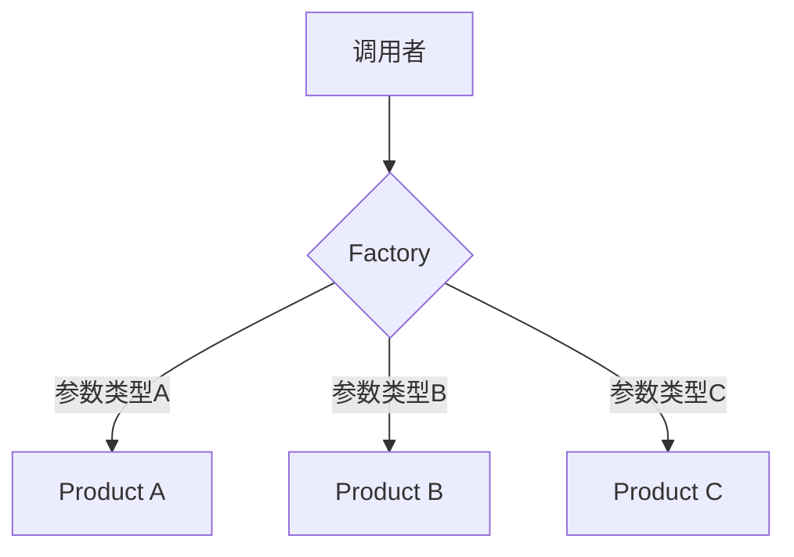

# 工厂模式 Factory Pattern

## 概念

工厂模式使用工厂函数（而非 `new` 关键字）来创建对象。当创建过程涉及复杂逻辑、条件判断，或需要返回不同类型的对象时，工厂模式能让调用方无需关心具体创建细节。

## 核心思想

将对象的创建逻辑封装在专门的工厂函数中，调用者只关心"能创建什么"，不关心"怎么创建"。



## 代码实现

### 基础工厂函数

```ts
interface User {
  firstName: string
  lastName: string
  email: string
  role: 'admin' | 'editor' | 'viewer'
  fullName(): string
}

function createUser(data: {
  firstName: string
  lastName: string
  email: string
  role?: 'admin' | 'editor' | 'viewer'
}): User {
  return {
    firstName: data.firstName,
    lastName: data.lastName,
    email: data.email,
    role: data.role ?? 'viewer',
    fullName() {
      return `${this.firstName} ${this.lastName}`
    },
  }
}
```

### 带分发逻辑的工厂

```ts
// 不同支付方式 — 策略 + 工厂混合
interface PaymentProcessor {
  pay(amount: number): Promise<{ success: boolean; transactionId: string }>
}

class WechatPay implements PaymentProcessor {
  async pay(amount: number) {
    return { success: true, transactionId: `wx_${Date.now()}` }
  }
}

class Alipay implements PaymentProcessor {
  async pay(amount: number) {
    return { success: true, transactionId: `ali_${Date.now()}` }
  }
}

class CreditCardPay implements PaymentProcessor {
  async pay(amount: number) {
    return { success: true, transactionId: `cc_${Date.now()}` }
  }
}

// 工厂——根据类型分发
function createPayment(type: 'wechat' | 'alipay' | 'creditcard'): PaymentProcessor {
  const map: Record<string, () => PaymentProcessor> = {
    wechat: () => new WechatPay(),
    alipay: () => new Alipay(),
    creditcard: () => new CreditCardPay(),
  }
  const factory = map[type]
  if (!factory) throw new Error(`Unknown payment type: ${type}`)
  return factory()
}

// 调用方无需知道具体类的构造函数
const processor = createPayment('alipay')
await processor.pay(100)
```

## 前端应用场景

| 场景 | 说明 |
|------|------|
| 组件工厂 | 根据数据动态渲染不同组件 |
| 表单控件工厂 | 根据字段类型创建不同 input（text/select/date） |
| 数据格式化器 | 根据 locale 返回不同格式化函数 |
| 弹窗管理器 | 统一创建不同类型的 Modal（confirm/alert/form） |

## 优缺点

**优点**
- 创建逻辑集中管理，修改一个工厂即可影响所有调用方
- 解耦"创建"与"使用"，调用方不依赖具体类
- 方便扩展新类型（添加新的 case 即可）

**缺点**
- 工厂函数可能膨胀为"上帝函数"，需要合理拆分
- 增加了一层抽象，对简单场景是过度设计
- 在 TypeScript 中类型推断可能不如直接 `new` 精确

> 来源：[JavaScript Design Patterns — Factory](https://www.patterns.dev/vanilla/factory-pattern)
