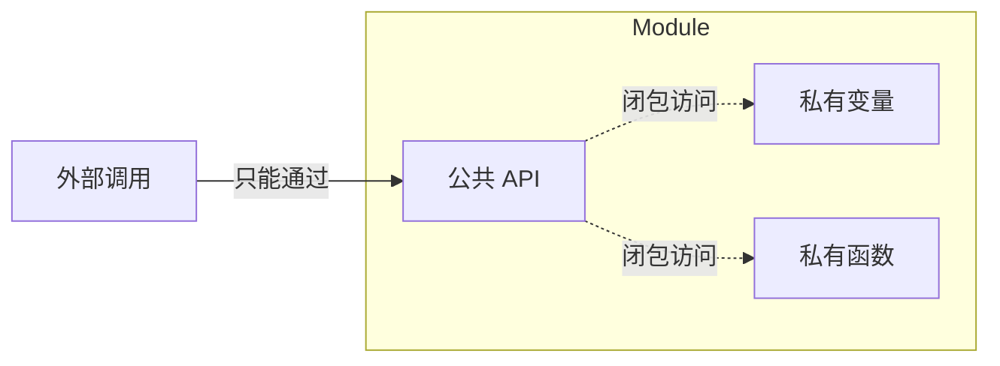

# 模块模式 Module Pattern

## 概念

模块模式是 JavaScript 中最常用的设计模式之一。它通过闭包创建私有作用域，只暴露必要的公共 API，从而封装内部实现细节。ES6 模块系统和 IIFE（立即执行函数表达式）都是模块模式的体现。

## 核心思想

利用函数作用域和闭包，创建私有变量和方法，返回一个包含公共 API 的对象。外部无法直接访问内部私有成员。



## 代码实现

### IIFE 模块（ES6 之前）

```ts
const Calculator = (function () {
  // 私有
  const HISTORY_KEY = 'calc_history'
  const history: string[] = []

  function validate(n: number): number {
    if (typeof n !== 'number' || Number.isNaN(n)) {
      throw new Error('Invalid number')
    }
    return n
  }

  function log(op: string, result: number): void {
    history.push(`${op} = ${result}`)
  }

  // 公共 API
  return {
    add(a: number, b: number): number {
      const result = validate(a) + validate(b)
      log(`${a} + ${b}`, result)
      return result
    },

    divide(a: number, b: number): number {
      if (b === 0) throw new Error('Division by zero')
      const result = validate(a) / b
      log(`${a} / ${b}`, result)
      return result
    },

    getHistory(): readonly string[] {
      return [...history]
    },

    clearHistory(): void {
      history.length = 0
    },
  }
})()
```

### ES Module（现代方式）

```ts
// storage.ts — 文件即模块
const PREFIX = 'app_'
const cache = new Map<string, unknown>()

function key(name: string): string {
  return `${PREFIX}${name}`
}

// 仅导出公共 API
export function get<T>(name: string): T | null {
  if (cache.has(name)) return cache.get(name) as T

  try {
    const raw = localStorage.getItem(key(name))
    return raw ? JSON.parse(raw) : null
  } catch {
    return null
  }
}

export function set(name: string, value: unknown): void {
  cache.set(name, value)
  localStorage.setItem(key(name), JSON.stringify(value))
}

export function remove(name: string): void {
  cache.delete(name)
  localStorage.removeItem(key(name))
}

export function clear(): void {
  cache.clear()
  localStorage.clear()
}
```

### Revealing Module（揭示模块）

```ts
// 在返回对象中只映射要暴露的私有函数
const EventBus = (function () {
  const listeners = new Map<string, Set<Function>>()

  function _on(event: string, fn: Function) {
    if (!listeners.has(event)) listeners.set(event, new Set())
    listeners.get(event)!.add(fn)
  }

  function _emit(event: string, ...args: unknown[]) {
    listeners.get(event)?.forEach(fn => fn(...args))
  }

  function _off(event: string, fn: Function) {
    listeners.get(event)?.delete(fn)
  }

  // Revealing — 显式暴露
  return {
    on: _on,
    emit: _emit,
    off: _off,
  }
})()
```

## 前端应用场景

| 场景 | 说明 |
|------|------|
| ES6 模块 | `import/export` — JavaScript 语言级模块 |
| 工具函数库 | Lodash、Dayjs 内部封装 |
| SDK 封装 | 隐藏内部 API 细节，暴露简洁接口 |
| 状态管理 | 私有 state，通过 getter/setter 访问 |
| 防抖/节流工具 | 内部维护 timer，只暴露调用方法 |

## 优缺点

**优点**
- **封装性强** — 私有变量完全隔离，防止全局污染
- **命名空间** — 避免命名冲突
- **代码组织清晰** — 职责明确，易于理解和维护

**缺点**
- 模块模式下无法轻易为私有成员编写单元测试
- 与 class 的继承体系不易结合
- 在现代开发中，TypeScript 的 `private` 和 ES 模块已基本覆盖模块模式需求

> 来源：[JavaScript Design Patterns — Module](https://www.patterns.dev/vanilla/module-pattern)
