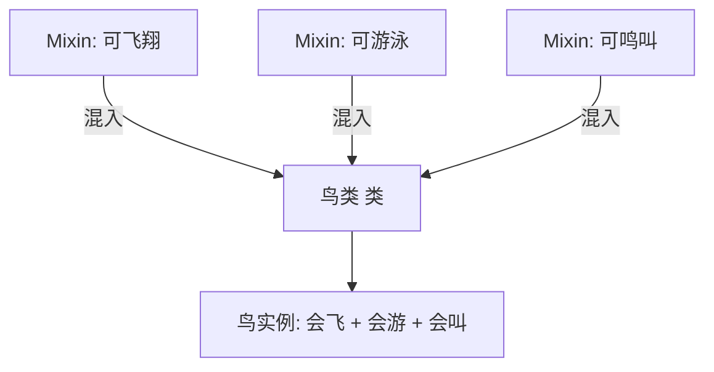

# 混合模式 Mixin Pattern

## 概念

Mixin 是一种不通过继承而为对象或类添加功能的方式。它将可复用的功能封装为独立对象，通过 `Object.assign` 或类似的混入机制注入到目标对象的原型上。

## 核心思想

将可复用的行为抽离为独立 Mixin 对象，需要时混入（而不是继承）到目标类中，实现"功能组合"而非"层级继承"。



## 代码实现

### 基础 Mixin

```ts
// 定义可复用的功能
const TimestampMixin = {
  createdAt: 0,
  updatedAt: 0,

  touch() {
    this.updatedAt = Date.now()
  },

  getAge(): string {
    const diff = Date.now() - this.createdAt
    return `${Math.floor(diff / 1000)}s ago`
  },
}

const SerializableMixin = {
  toJSON(): Record<string, unknown> {
    const result: Record<string, unknown> = {}
    for (const key of Object.keys(this)) {
      if (!key.startsWith('_')) {
        result[key] = (this as any)[key]
      }
    }
    return result
  },
}

// 混入到类
function applyMixins(target: any, ...mixins: any[]) {
  mixins.forEach(mixin => Object.assign(target.prototype, mixin))
}

class Post {
  constructor(
    public title: string,
    public content: string
  ) {
    this.createdAt = Date.now()
  }
}

interface Post extends TimestampMixinType, SerializableMixinType {}
applyMixins(Post, TimestampMixin, SerializableMixin)

const post = new Post('Hello', 'World')
post.touch()
console.log(post.getAge())
console.log(post.toJSON())
```

### 函数式 Mixin（推荐）

```ts
// Mixin 工厂 — 更现代的函数式方法
type Constructor<T = {}> = new (...args: any[]) => T

function Timestampable<TBase extends Constructor>(Base: TBase) {
  return class extends Base {
    createdAt: number = Date.now()
    updatedAt: number = Date.now()

    touch(): void {
      this.updatedAt = Date.now()
    }
  }
}

function SoftDeletable<TBase extends Constructor>(Base: TBase) {
  return class extends Base {
    deletedAt: number | null = null

    get isDeleted(): boolean {
      return this.deletedAt !== null
    }

    softDelete(): void {
      this.deletedAt = Date.now()
    }

    restore(): void {
      this.deletedAt = null
    }
  }
}

// 组合 Mixin
class BaseModel {
  id: string = crypto.randomUUID()
}

class User extends SoftDeletable(Timestampable(BaseModel)) {
  constructor(public name: string, public email: string) {
    super()
  }
}

const user = new User('Alice', 'alice@example.com')
console.log(user.createdAt) // 来自 Timestampable
user.softDelete()            // 来自 SoftDeletable
console.log(user.isDeleted)  // true
```

## 前端应用场景

| 场景 | 说明 |
|------|------|
| React (旧版) | `React.createClass` 时代的 Mixin |
| Vue 2 Mixin | 组件间共享逻辑（Options API） |
| 数据模型增强 | 给模型类混入 Timestampable/SoftDeletable |
| 工具方法混入 | 给 DOM 元素或对象混入辅助方法 |
| 日志/埋点 | 混入统一的 track/log 能力 |

## 优缺点

**优点**
- 避免深层继承链，通过组合实现代码复用
- 功能单元粒度小、职责单一
- 可动态组合，灵活度高于继承

**缺点**
- 命名冲突风险（多个 Mixin 有同名方法）
- 依赖隐式，IDE 难以追踪方法来源
- React/Vue 社区现在推荐 Hooks/Composition API 替代 Mixin
- 原型链修改可能影响性能

> 来源：[JavaScript Design Patterns — Mixin](https://www.patterns.dev/vanilla/mixin-pattern)
