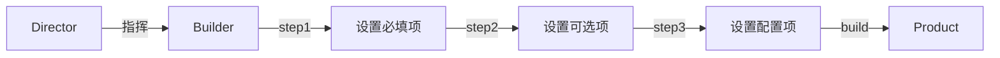

# 建造者模式 Builder Pattern

## 概念

建造者模式将复杂对象的"构建过程"与其"表示"分离，使得同样的构建过程可以创建不同的表示。当对象有大量可选参数或需要分步骤构建时，Builder 模式非常有用。

## 核心思想

通过链式调用逐步设置属性，最后调用 `build()` 产出最终对象。



## 代码实现

### 请求构造器

```ts
interface RequestConfig {
  url: string
  method: 'GET' | 'POST' | 'PUT' | 'DELETE'
  headers: Record<string, string>
  body?: unknown
  timeout?: number
  retry?: number
  signal?: AbortSignal
}

class RequestBuilder {
  private config: Partial<RequestConfig> = {
    method: 'GET',
    headers: { 'Content-Type': 'application/json' },
    timeout: 5000,
    retry: 0,
  }

  constructor(private url: string) {}

  method(m: RequestConfig['method']): this {
    this.config.method = m
    return this
  }

  header(key: string, value: string): this {
    this.config.headers![key] = value
    return this
  }

  body(data: unknown): this {
    this.config.body = data
    return this
  }

  timeout(ms: number): this {
    this.config.timeout = ms
    return this
  }

  retry(times: number): this {
    this.config.retry = times
    return this
  }

  abort(signal: AbortSignal): this {
    this.config.signal = signal
    return this
  }

  build(): RequestConfig {
    return this.config as RequestConfig
  }
}

// 使用——链式构建，意图清晰
const config = new RequestBuilder('/api/users')
  .method('POST')
  .header('Authorization', 'Bearer token')
  .body({ name: 'Alice' })
  .timeout(10000)
  .retry(3)
  .build()
```

### 表单构造器

```ts
interface FormField {
  name: string
  label: string
  type: 'text' | 'number' | 'select' | 'date'
  required?: boolean
  defaultValue?: unknown
  validator?: (value: unknown) => string | null
  options?: { label: string; value: string }[]
}

class FormFieldBuilder {
  private field: Partial<FormField> = { required: false }

  constructor(name: string, label: string) {
    this.field.name = name
    this.field.label = label
  }

  type(t: FormField['type']): this { this.field.type = t; return this }
  required(): this { this.field.required = true; return this }
  default(value: unknown): this { this.field.defaultValue = value; return this }
  validate(fn: FormField['validator']): this { this.field.validator = fn; return this }
  options(opts: FormField['options']): this { this.field.options = opts; return this }

  build(): FormField { return this.field as FormField }
}

// 声明式表单定义
const emailField = new FormFieldBuilder('email', '邮箱')
  .type('text')
  .required()
  .validate(v => /^.+@.+$/.test(String(v)) ? null : '邮箱格式不正确')
  .build()
```

## 前端应用场景

| 场景 | 说明 |
|------|------|
| HTTP 请求构造 | 逐步设置 url/method/headers/body |
| 表单 DSL 构建 | 声明式定义表单字段（参考 Formily） |
| ECharts 配置 | Option 对象分步构造 |
| 测试数据工厂 | 链式构建复杂 Mock 数据 |

## 优缺点

**优点**
- 链式调用语义清晰，易于读写
- 可选参数处理优雅，避免构造函数多参数噩梦
- 构建过程可复用、可中断、可验证

**缺点**
- 增加了 Builder 类的开发和维护成本
- 简单对象使用 Builder 是过度设计
- 链式 API 调试困难（断点只能打在单行）

> 来源：[Refactoring Guru — Builder](https://refactoring.guru/design-patterns/builder)
