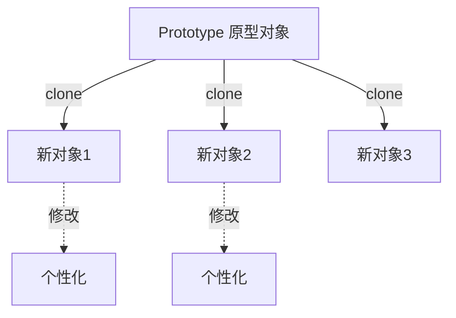

# 原型模式 Prototype Pattern

## 概念

原型模式通过"克隆"已有对象来创建新对象，而非通过类实例化。在 JavaScript 中，原型链本身就是该模式的体现——`Object.create()` 就是典型的原型模式 API。

## 核心思想

以现有对象为模板，复制（深/浅拷贝）来创建新对象，避免重复初始化开销。



## 代码实现

### Object.create —— JavaScript 原生原型模式

```ts
// 模板对象（原型）
const formTemplate = {
  fields: [] as string[],
  validate(): boolean {
    return this.fields.every(f => f.trim() !== '')
  },
  submit(): void {
    if (!this.validate()) throw new Error('Validation failed')
    console.log('Submitting', this.fields)
  },
}

// 克隆原型
const loginForm = Object.create(formTemplate)
loginForm.fields = ['username', 'password']

const registerForm = Object.create(formTemplate)
registerForm.fields = ['username', 'email', 'password', 'confirmPassword']
```

### 通用 Clone 工具

```ts
class Prototype<T extends object> {
  constructor(private source: T) {}

  // 浅克隆
  shallow(): T {
    return Object.assign(Object.create(Object.getPrototypeOf(this.source)), this.source)
  }

  // 深克隆（生产环境推荐 structuredClone）
  deep(): T {
    return structuredClone(this.source) as T
  }

  // 带覆盖的克隆
  cloneWith(overrides: Partial<T>): T {
    return { ...this.shallow(), ...overrides }
  }
}

// 使用
const defaultConfig = { theme: 'light' as const, locale: 'zh-CN', debug: false }
const prodConfig = new Prototype(defaultConfig).cloneWith({ debug: false })
const devConfig = new Prototype(defaultConfig).cloneWith({ debug: true })
```

## 前端应用场景

| 场景 | 说明 |
|------|------|
| 表单模板 | 复制基础表单结构再定制 |
| 配置继承 | 从默认配置克隆后覆盖差异项 |
| Canvas 图形 | 复制图形原型后修改位置/颜色等属性 |
| 状态快照 | 编辑前 `structuredClone` 保存，用于撤销 |

## 优缺点

**优点**
- 避免重复初始化开销，尤其当创建开销大时
- 简化"模板+差异化"场景的代码
- JavaScript 原生支持（`Object.create`、`structuredClone`）

**缺点**
- 深拷贝循环引用场景需额外处理
- `Object.create` 创建的对象属性在原型链上，`hasOwnProperty` 检查需留意
- 过度使用会让对象间关系复杂，难以追踪修改来源

> 来源：[JavaScript Design Patterns — Prototype](https://www.patterns.dev/vanilla/prototype-pattern)
