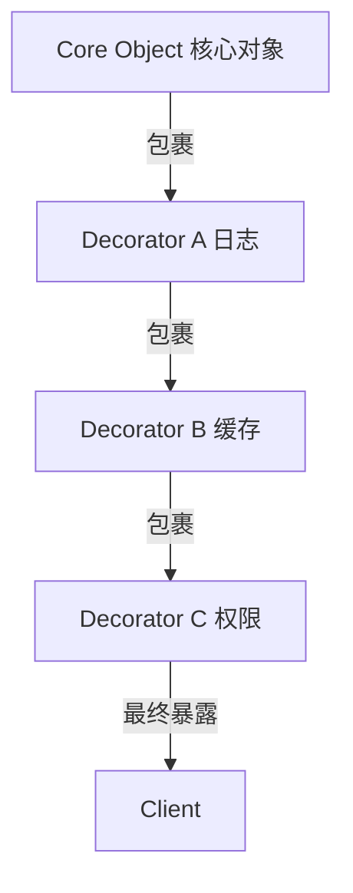

# 装饰器模式 Decorator Pattern

## 概念

装饰器模式动态地为对象添加额外的职责，而不改变其原有结构。在 JavaScript/TypeScript 中，装饰器可以通过高阶函数、`Proxy` 或原生装饰器语法实现。

## 核心思想

将对象"包裹"在一个装饰器中，装饰器可以在原方法执行前后添加逻辑，就像洋葱圈叠加。



## 代码实现

### 高阶函数装饰器（前端最常用）

```ts
// 核心功能
interface DataService {
  fetch(id: string): Promise<{ data: string }>
}

class ApiService implements DataService {
  async fetch(id: string): Promise<{ data: string }> {
    return { data: `Result for ${id}` }
  }
}

// 日志装饰器
function withLogging(service: DataService): DataService {
  return {
    async fetch(id: string) {
      console.log(`[LOG] fetch start: ${id}`)
      const start = performance.now()
      const result = await service.fetch(id)
      console.log(`[LOG] fetch done: ${id} (${(performance.now() - start).toFixed(0)}ms)`)
      return result
    },
  }
}

// 缓存装饰器
function withCache(service: DataService): DataService {
  const cache = new Map<string, Promise<{ data: string }>>()
  return {
    async fetch(id: string) {
      if (cache.has(id)) return cache.get(id)!
      const promise = service.fetch(id)
      cache.set(id, promise)
      return promise
    },
  }
}

// 组合装饰器
const base = new ApiService()
const service = withCache(withLogging(base))
```

### 函数装饰器（AOP 切面）

```ts
// 通用装饰器工厂
function decorate<T extends (...args: any[]) => any>(
  fn: T,
  around: (next: T, ...args: Parameters<T>) => ReturnType<T>
): T {
  return ((...args: Parameters<T>) => around(fn, ...args)) as T
}

// 重试装饰器
function withRetry<T extends (...args: any[]) => Promise<any>>(
  fn: T,
  maxRetries = 3
): T {
  return decorate(fn, async (next, ...args) => {
    for (let attempt = 1; attempt <= maxRetries; attempt++) {
      try {
        return await next(...args)
      } catch (err) {
        if (attempt === maxRetries) throw err
        await new Promise(r => setTimeout(r, 1000 * attempt))
      }
    }
  })
}

// 防抖装饰器
function withDebounce<T extends (...args: any[]) => void>(
  fn: T,
  delay = 300
): T {
  let timer: ReturnType<typeof setTimeout>
  return ((...args: Parameters<T>) => {
    clearTimeout(timer)
    timer = setTimeout(() => fn(...args), delay)
  }) as T
}
```

## 前端应用场景

| 场景 | 说明 |
|------|------|
| 日志/埋点 | 给关键函数加日志记录，不影响业务逻辑 |
| 缓存/去重 | 给 API 调用加缓存层 |
| 重试/降级 | 网络请求失败自动重试 |
| 权限校验 | 在操作前检查权限 |
| HOC (React) | 高阶组件本质就是组件装饰器 |

## 优缺点

**优点**
- 比继承更灵活，可以动态组合装饰器
- 每个装饰器职责单一，符合单一职责原则
- 运行时动态添加/移除功能

**缺点**
- 多层装饰器调试困难（调用栈深）
- 装饰器顺序可能影响结果
- 过度装饰会导致"洋葱地狱"

> 来源：[JavaScript Design Patterns — Decorator](https://www.patterns.dev/vanilla/decorator-pattern)
