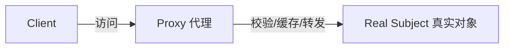

# 代理模式 Proxy Pattern

## 概念

代理模式为另一个对象提供一个替身或占位符，以控制对该对象的访问。ES6 原生 `Proxy` 让 JavaScript 中实现代理模式非常简洁，常见用于拦截、校验、缓存等场景。

## 核心思想

在目标对象之前设置一个"关卡"，所有对目标的访问都先经过代理。



## 代码实现

### 访问控制代理

```ts
interface UserData {
  id: string
  name: string
  role: 'admin' | 'user'
  email: string
  salary?: number // 仅 admin 可见
}

// 权限代理：user 角色看不到 salary
function createUserProxy(user: UserData): UserData {
  return new Proxy(user, {
    get(target, prop, receiver) {
      if (prop === 'salary' && target.role !== 'admin') {
        console.warn(`Access denied: ${String(prop)}`)
        return undefined
      }
      return Reflect.get(target, prop, receiver)
    },
  })
}
```

### 缓存代理

```ts
// 为高开销计算加缓存
function createMemoProxy<T extends object>(target: T): T {
  const cache = new Map<string | symbol, unknown>()

  return new Proxy(target, {
    get(target, prop, receiver) {
      if (cache.has(prop)) return cache.get(prop)
      const value = Reflect.get(target, prop, receiver)
      // 自动缓存 getter 结果
      if (typeof value !== 'function') {
        cache.set(prop, value)
      }
      return value
    },
  })
}
```

### 虚拟代理 —— 图片懒加载

```ts
// 虚拟代理：占位图 → 真实图片加载完成后替换
function createImageProxy(src: string, placeholder: string): HTMLImageElement {
  const img = new Image()
  img.src = placeholder // 先显示占位图

  const realImage = new Image()
  realImage.onload = () => {
    img.src = src
  }
  realImage.src = src // 后台加载真实图片

  return img
}
```

### 请求去重代理

```ts
// 并发请求去重：同一 key 的请求共享同一个 Promise
function createDedupProxy<T extends (...args: any[]) => Promise<any>>(fn: T): T {
  const pending = new Map<string, ReturnType<T>>()

  return (async (...args: Parameters<T>) => {
    const key = JSON.stringify(args)
    if (!pending.has(key)) {
      pending.set(key, fn(...args))
    }
    try {
      return await pending.get(key)!
    } finally {
      pending.delete(key)
    }
  }) as T
}
```

## 前端应用场景

| 场景 | 说明 |
|------|------|
| Vue 3 响应式 | `reactive()` 基于 Proxy 实现 |
| 数据校验 | 拦截 set 操作做表单校验 |
| 接口缓存 | 代理 fetch，相同请求复用 Promise |
| 懒加载/预加载 | 虚拟代理处理图片/组件 |
| 日志/调试 | 代理对象自动记录属性访问 |
| 请求去重 | 同一请求并发时共享结果 |

## 优缺点

**优点**
- 对目标对象无侵入，透明代理
- ES6 Proxy 支持 13 种拦截操作，功能全面
- 代理和真实对象符合相同接口，可无缝替换

**缺点**
- Proxy 有轻微性能开销
- 不支持 IE（无 polyfill）
- 过度使用会让数据流向难以追踪

> 来源：[JavaScript Design Patterns — Proxy](https://www.patterns.dev/vanilla/proxy-pattern)
