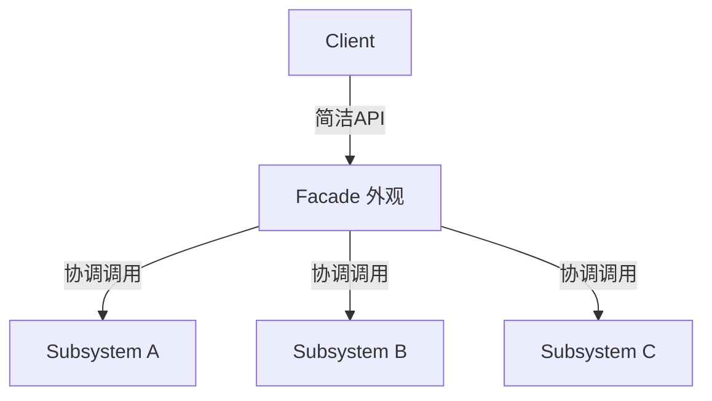

# 外观模式 Facade Pattern

## 概念

外观模式为子系统中的一组接口提供一个统一的高层接口，使得子系统更容易使用。它就像餐厅的前台服务员——你只需告诉服务员要什么，后厨的复杂流程由服务员协调。

## 核心思想

封装底层复杂性，对外暴露简洁的 API。



## 代码实现

### 前端常见：封装浏览器 API

```ts
// 封装多个底层 API 为一个简洁的存储服务
class StorageService {
  private prefix = 'app_'

  get<T>(key: string): T | null {
    try {
      const raw = localStorage.getItem(this.prefix + key)
      return raw ? JSON.parse(raw) : null
    } catch {
      return null
    }
  }

  set(key: string, value: unknown): void {
    try {
      localStorage.setItem(this.prefix + key, JSON.stringify(value))
    } catch (err) {
      if (err instanceof DOMException && err.name === 'QuotaExceededError') {
        this.clearExpired() // 自动清理过期数据
        this.set(key, value) // 重试
        return
      }
      console.error('Storage set failed', err)
    }
  }

  remove(key: string): void {
    localStorage.removeItem(this.prefix + key)
  }

  // 内部协调多个 API
  private clearExpired(): void {
    for (let i = 0; i < localStorage.length; i++) {
      const key = localStorage.key(i)
      if (!key?.startsWith(this.prefix)) continue
      const raw = localStorage.getItem(key)
      if (!raw) continue
      try {
        const data = JSON.parse(raw)
        if (data.expireAt && Date.now() > data.expireAt) {
          localStorage.removeItem(key)
        }
      } catch { /* skip malformed */ }
    }
  }
}
```

### 模块聚合外观

```ts
// 场景：用户注册流程涉及多个服务
class UserService {
  async create(data: { name: string; email: string }) { /* ... */ }
}

class EmailService {
  async sendVerify(email: string, token: string) { /* ... */ }
}

class AnalyticsService {
  async track(event: string, props: Record<string, unknown>) { /* ... */ }
}

// Facade — 一键注册
class RegistrationFacade {
  constructor(
    private user: UserService,
    private email: EmailService,
    private analytics: AnalyticsService
  ) {}

  async signUp(data: { name: string; email: string; password: string }): Promise<string> {
    const user = await this.user.create(data)
    await this.email.sendVerify(data.email, user.verifyToken)
    this.analytics.track('signup', { userId: user.id })
    return user.id
  }
}
```

## 前端应用场景

| 场景 | 说明 |
|------|------|
| 浏览器存储封装 | 统一 localStorage/sessionStorage/IndexedDB 的接口 |
| 第三方 SDK 封装 | 封装微信支付/地图/推送等复杂 SDK |
| 状态管理 | Pinia store 是对多个 API 的外观封装 |
| 跨平台适配 | 一套 API 适配 Web/小程序/Native |

## 优缺点

**优点**
- 降低使用复杂度，新手友好
- 减少外部对子系统的依赖，便于子系统重构
- 集中管理跨横切面逻辑（如错误处理、日志）

**缺点**
- 外观可能变成"上帝对象"，违反单一职责
- 过度封装会隐藏子系统能力，高级用户不够灵活
- 增加一层间接调用，微小性能代价

> 来源：[Refactoring Guru — Facade](https://refactoring.guru/design-patterns/facade)
