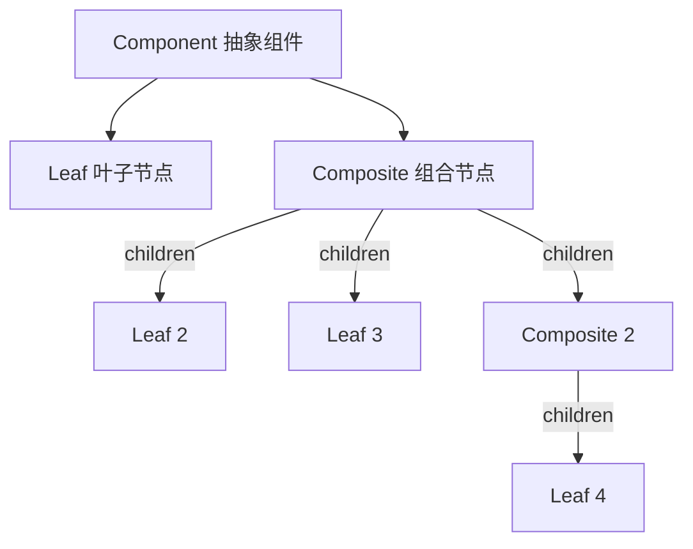

# 组合模式 Composite Pattern

## 概念

组合模式将对象组合成树形结构，以表示"部分—整体"的层次结构。它让客户端可以统一地对待单个对象和组合对象（容器）。最典型的例子就是 DOM 树，以及文件系统的目录/文件结构。

## 核心思想

定义统一接口，叶子节点和组合节点都实现同一接口，客户端无需区分处理。



## 代码实现

### 菜单系统

```ts
// 统一接口
interface MenuComponent {
  getName(): string
  render(indent?: number): string
}

// 叶子节点 — 具体菜单项
class MenuItem implements MenuComponent {
  constructor(private name: string, private url: string, private icon?: string) {}

  getName(): string { return this.name }

  render(indent = 0): string {
    const pad = '  '.repeat(indent)
    return `${pad}${this.icon ?? '📄'} <a href="${this.url}">${this.name}</a>`
  }
}

// 组合节点 — 菜单分组
class MenuGroup implements MenuComponent {
  private children: MenuComponent[] = []

  constructor(private name: string) {}

  getName(): string { return this.name }

  add(child: MenuComponent): this {
    this.children.push(child)
    return this
  }

  remove(child: MenuComponent): void {
    this.children = this.children.filter(c => c !== child)
  }

  render(indent = 0): string {
    const pad = '  '.repeat(indent)
    const header = `${pad}📁 ${this.name}`
    const body = this.children.map(c => c.render(indent + 1)).join('\n')
    return `${header}\n${body}`
  }
}

// 使用 — 构建树
const nav = new MenuGroup('主导航')
  .add(new MenuItem('首页', '/', '🏠'))
  .add(new MenuItem('关于', '/about', 'ℹ️'))
  .add(
    new MenuGroup('产品')
      .add(new MenuItem('产品A', '/product/a'))
      .add(new MenuItem('产品B', '/product/b'))
  )

console.log(nav.render())
// 📁 主导航
//   🏠 <a href="/">首页</a>
//   ℹ️ <a href="/about">关于</a>
//   📁 产品
//     📄 <a href="/product/a">产品A</a>
//     📄 <a href="/product/b">产品B</a>
```

### 递归组件（Vue 示例思路）

```ts
// TreeItem 既是叶子也可以是容器——递归自组合
interface TreeNode {
  id: string
  label: string
  children?: TreeNode[]
}

function renderTree(nodes: TreeNode[]): string {
  return nodes.map(node => {
    if (node.children?.length) {
      return `<details><summary>${node.label}</summary>${renderTree(node.children)}</details>`
    }
    return `<div>${node.label}</div>`
  }).join('')
}
```

## 前端应用场景

| 场景 | 说明 |
|------|------|
| DOM 树操作 | 对单个元素和元素组统一操作 |
| 菜单/导航组件 | 无限层级菜单 |
| 树形组件 | 文件树、组织架构图、目录树 |
| 表单容器 | 字段可以嵌套字段组（FormGroup 包含 FormControl） |
| 渲染引擎 | VNode 树的递归 diff/patch |

## 优缺点

**优点**
- 客户端统一处理叶子与容器，简化调用逻辑
- 符合开闭原则——新增组件类型无需修改客户端
- 自然支持递归，适合树形结构

**缺点**
- 叶子与容器接口完全相同，某些操作对叶子无意义（如 add/remove）
- 类型安全需要在运行时检查，不如独立类型严谨
- 过度使用会让设计过于通用，丧失类型特异性

> 来源：[Refactoring Guru — Composite](https://refactoring.guru/design-patterns/composite)
