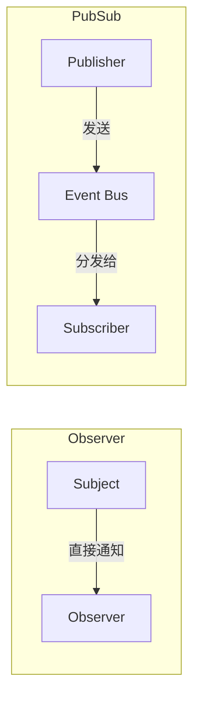

# 观察者模式和发布订阅模式的区别是什么？

## 核心回答

两者的核心区别在于**是否有独立的事件调度中心**：

- **观察者模式**：Subject（被观察者）直接维护 Observer 列表并通知，两者是**直接依赖**关系
- **发布-订阅模式**：Publisher 和 Subscriber 完全**互不知晓**，通过 Event Channel（事件总线）解耦



```ts
// 观察者：Subject 和 Observer 直接耦合
class Subject {
  private observers: Observer[] = []
  subscribe(obs: Observer) { this.observers.push(obs) }
  notify(data: unknown) { this.observers.forEach(o => o.update(data)) }
}

// 发布-订阅：双方通过 Event Bus 解耦
const bus = new EventBus()
bus.emit('order:created', data)   // 发布者不知道谁在听
bus.on('order:created', handler)   // 订阅者不知道谁发的
```

**面试关键点**：观察者是"我直接告诉你"，发布订阅是"我把消息贴到公告栏，谁关心谁来看"。

> 来源：[Observer vs PubSub](https://www.patterns.dev/vanilla/observer-pattern)
