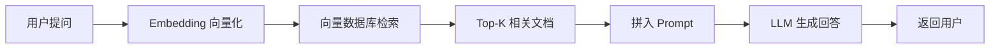

# 面试官问：什么是 RAG？前端如何实现一个 RAG 对话？

> 📚 参考：[RAG 检索增强生成](/直击概念/17ai/s_ai_23-rag) | [Embedding 向量嵌入](/直击概念/17ai/s_ai_9-embedding) | [向量数据库](/直击概念/17ai/s_ai_26-vector_database)

## 1. 什么是 RAG？前端如何实现一个 RAG 对话？

**考察点**：是否理解 RAG 的检索增强生成流程，知道分块策略的重要性，以及前端实现 RAG 的可行方案。

::: details

## 核心回答

**RAG**（Retrieval-Augmented Generation）将**信息检索**和**大模型生成**结合，让模型"带着参考资料"回答，大幅减少幻觉。

```text
RAG 流程：
用户提问 → 向量化问题 → 向量数据库中检索相关文档
→ 把检索结果拼进 Prompt → 大模型基于资料生成回答

类比：不是"闭卷考试"（纯靠模型记忆），而是"开卷考试"（带着参考资料回答）
```



**前端实现 RAG 的完整方案**：

```ts
// 1. 文档入库（预处理阶段，通常在服务端）
async function ingestDocument(text: string) {
  // 分块——每块 500-1000 token，重叠 100 token
  const chunks = chunkText(text, { maxTokens: 500, overlap: 100 })
  
  for (const chunk of chunks) {
    const embedding = await getEmbedding(chunk)
    await vectorDB.insert({ text: chunk, embedding })
  }
}

// 2. 问答流程（运行时）
async function ragQuery(userQuestion: string, history: Message[]) {
  // Step 1: 问题向量化
  const queryEmbedding = await getEmbedding(userQuestion)
  
  // Step 2: 检索 Top-K 相关文档
  const relevantDocs = await vectorDB.search(queryEmbedding, { topK: 5 })
  const context = relevantDocs.map(d => d.text).join('\n---\n')
  
  // Step 3: 构造增强 Prompt
  const prompt = `
你是一个基于知识库的助手。请根据以下资料回答问题。
如果资料中没有答案，请直接说"知识库中暂无相关信息"。

资料：
${context}

用户问题：${userQuestion}
`
  // Step 4: 调用 LLM
  return await chat(prompt, history)
}
```

**前端能做的部分**：
- 🌐 调用后端 RAG API（推荐，安全可控）
- 💻 纯前端轻量 RAG（小模型 + 浏览器向量库如 LanceDB-WASM、DuckDB-WASM）
- 📱 混合方案：前端做检索渲染，后端做 Embedding 和 LLM 调用

## 面试回答要点

- 画 RAG 流程图：提问 → 向量化 → 检索 → 拼 Prompt → LLM 生成
- 解释"开卷考试"类比
- 说清楚"分块策略"的重要性（块太大不精准，太小缺上下文）

:::

> 来源：[RAG 检索增强生成概念讲解](/直击概念/17ai/s_ai_23-rag)
