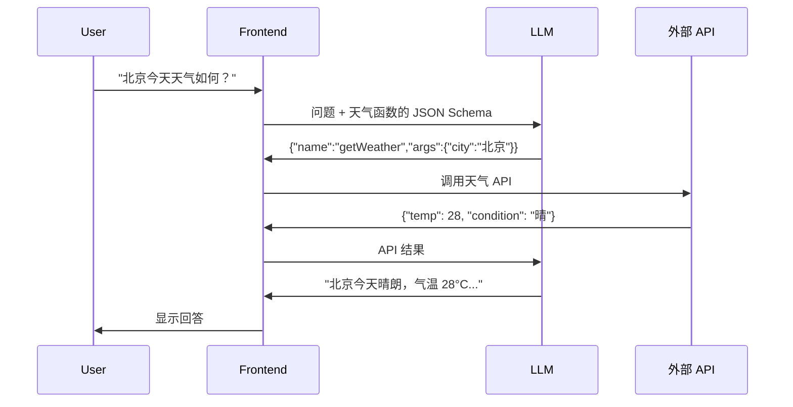

# 面试官问：Function Calling / Tool Use 的工作流程？前端怎么用？

> 📚 参考：[Function Calling](/直击概念/17ai/s_ai_25-function_calling) | [AI Agent 智能体](/直击概念/17ai/s_ai_24-agent)

## 1. Function Calling / Tool Use 的工作流程？前端怎么用？

**考察点**：是否理解 Function Calling 的完整调用链路，知道如何用 JSON Schema 定义工具，以及前端集成时的安全注意事项。

::: details

## 核心回答

Function Calling 让大模型**不只是生成文本**，还能**决定调用哪个函数、传什么参数**，让 AI 从"脑子"变成"手+脑子"。

```text
传统 LLM：你问 → 它答（纯文本）
+ Function Calling：你问 → 它决定调哪个 API → 你把结果给它 → 它总结回答
```



**定义工具 Schema**：

```ts
// 告诉模型：你有哪些可用工具
const tools = [{
  type: 'function',
  function: {
    name: 'getWeather',
    description: '获取指定城市的当前天气',
    parameters: {
      type: 'object',
      properties: {
        city: { type: 'string', description: '城市名称，如 "北京"' },
      },
      required: ['city'],
    },
  },
}]

// 调用 LLM
const response = await openai.chat.completions.create({
  model: 'gpt-4',
  messages: [{ role: 'user', content: '北京天气怎么样？' }],
  tools,
  tool_choice: 'auto', // 模型自动决定是否调用工具
})

// 模型返回工具调用请求
// response.choices[0].message.tool_calls = [{ function: { name: 'getWeather', arguments: '{"city":"北京"}' } }]
```

**前端实战关键点**：
- 🔒 **不要在前端直接暴露敏感 API**：Function Calling 应该通过后端代理
- ✅ **适合前端场景**：搜索、筛选、导航、表单填写（调用前端本地函数）
- ⚠️ **安全原则**：模型输出的函数参数必须校验，不能直接信任
- 📊 **显示工具调用状态**：用户等待时展示"正在查询天气..."加载态

## 面试回答要点

- 画流程图：用户问 → LLM 决定调工具 → 前端执行 → LLM 总结
- 知道工具是用 JSON Schema 定义的
- 强调安全：不要在前端直接调用敏感 API

:::

> 来源：[Function Calling 概念讲解](/直击概念/17ai/s_ai_25-function_calling)
